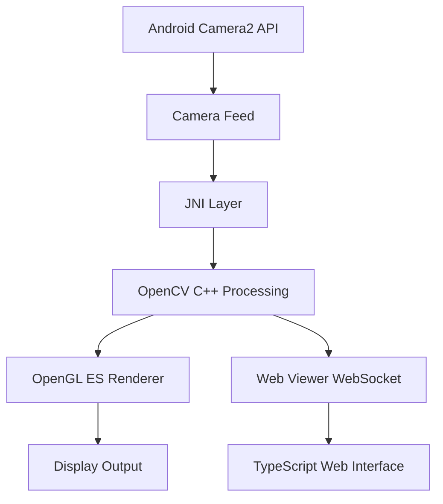

# Edge Detection App

An Android application that captures camera frames, processes them using OpenCV in C++ (via JNI), and displays the processed output using OpenGL ES. Additionally includes a TypeScript-based web viewer to demonstrate bridging native processing results to a web interface.

## 📋 Features

### Android App
- Real-time camera feed capture using Camera2 API
- OpenCV C++ processing with JNI integration
- Canny Edge Detection and Grayscale filtering
- OpenGL ES 2.0 rendering pipeline
- Toggle between raw camera feed and edge-detected output
- Real-time FPS counter and frame statistics

### Web Viewer
- TypeScript-based web interface for viewing processed frames
- Frame statistics display (FPS, resolution, processing time)
- Simulated streaming from Android app

## 🏗️ Architecture



### Component Structure
- `/app` - Android Java/Kotlin code
- `/jni` - C++ OpenCV processing
- `/gl` - OpenGL renderer classes
- `/web` - TypeScript web viewer

## 🚀 Getting Started

### Prerequisites

- Android Studio Arctic Fox or later
- Android SDK API level 24+
- NDK (Native Development Kit)
- CMake 3.18.1+
- OpenCV 4.11.0 Android SDK

### Setup Instructions

1. **Clone the repository**
   ```bash
   git clone <repository-url>
   cd edge-detection-app
   ```

2. **Download OpenCV SDK**
   - Download OpenCV 4.11.0 Android SDK from [OpenCV Releases](https://opencv.org/releases/)
   - Extract to `app/src/main/jniLibs/opencv`

3. **Configure OpenCV in build.gradle**
   ```gradle
   android {
       sourceSets {
           main {
               jniLibs.srcDirs = ['src/main/jniLibs']
           }
       }
   }
   
   dependencies {
       implementation project(':opencv')
   }
   ```

4. **Build the project**
   ```bash
   ./gradlew build
   ```

5. **Run the Android app**
   ```bash
   ./gradlew installDebug
   ```

6. **Run the Web Viewer**
   ```bash
   cd web
   npm install
   npm start
   ```

## 🧪 Testing

### Android Tests
```bash
./gradlew test
```

### Web Tests
```bash
cd web
npm test
```

## 📸 Screenshots


*Android app showing edge detection output*


*Web viewer displaying processed frames*

## 🎯 Performance

- Real-time processing at 15-30 FPS (depending on device)
- Frame processing time: 10-30ms
- Memory efficient with proper resource management

## 🛠️ Development

### Android Development

1. **Adding new OpenCV algorithms**
   - Modify `jni/ImageProcessor.cpp`
   - Update native method signatures in `ImageProcessorNative.java`

2. **Adding new OpenGL effects**
   - Modify shaders in `OpenGLRenderer.java`
   - Update vertex/fragment shader code

### Web Development

1. **Run development server**
   ```bash
   cd web
   npm run dev
   ```

2. **Build for production**
   ```bash
   npm run build
   ```

## 📚 Documentation

### JNI Layer
The JNI layer bridges Java/Kotlin code with C++ OpenCV processing:
- `ImageProcessorNative.java` - Java interface
- `native-lib.cpp` - JNI implementation
- `ImageProcessor.cpp` - OpenCV processing logic

### OpenCV Processing
OpenCV algorithms implemented:
- Grayscale conversion
- Canny Edge Detection
- Gaussian Blur (optional)

### OpenGL Rendering
OpenGL ES 2.0 implementation:
- Vertex and fragment shaders
- Texture mapping
- Real-time rendering pipeline

## 🤝 Contributing

1. Fork the repository
2. Create a feature branch
3. Commit your changes
4. Push to the branch
5. Create a Pull Request

## 📄 License

This project is licensed under the MIT License - see the [LICENSE](LICENSE) file for details.

## 🙏 Acknowledgments

- OpenCV team for the computer vision library
- Android documentation for Camera2 API guidance